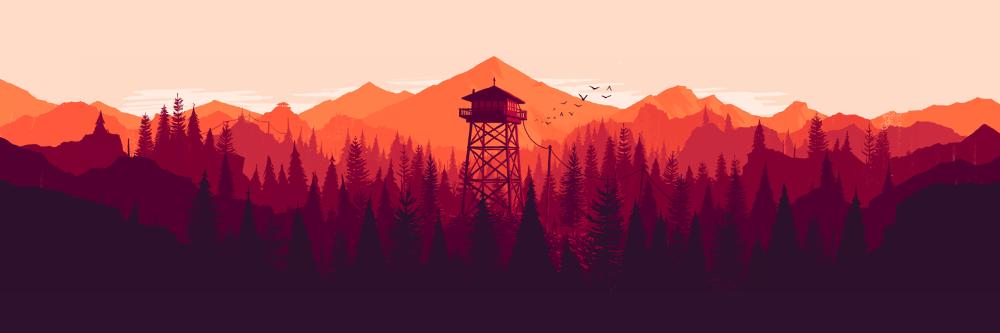
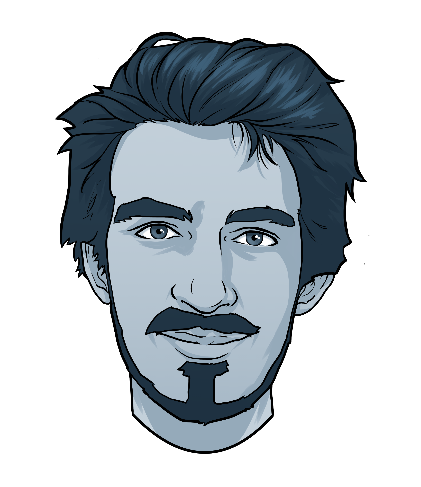

# Hi there i'm Paul Souillé, french developper 

## 🔭 I’m currently working with NestJS, Vue and Angular for Claranet

## 💼 Some of languages i like to work with

* Javascript
* **Typescript**
* Java
* ~~PHP~~

 

## 📈 My GitHub Stats:

  
  

